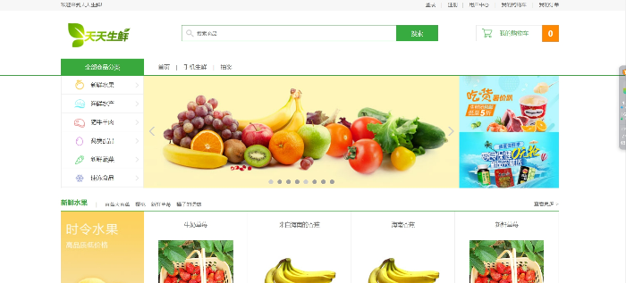
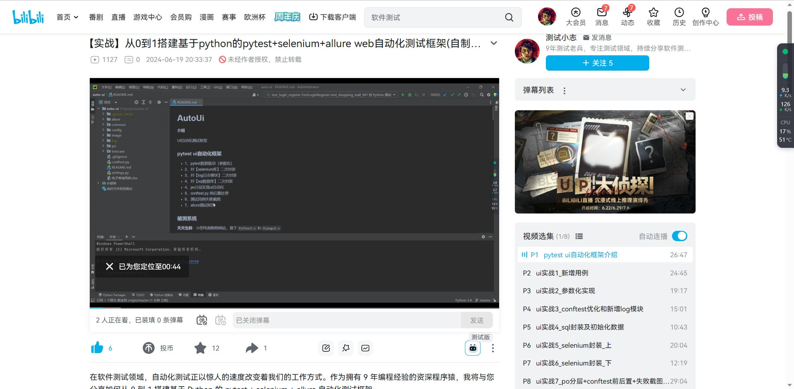

# web自动化测试框架

#### pytest+selenium+allure+log+sql+po分层 

### 一、介绍
- 本框架借鉴PageObject的分层设计思想
- 框架主要分为三块：po(selenium)层、event层、testcases层
- 为解决用例链路长编写复杂的难点，本框架易用性和复用性以及可维护性大大加强
- 兼容性和拓展性：后续可以相对方便的进行功能拓展，如：jenkins接入、性能测试、搭建平台、编写造数插件
- pytest快速入门  [详细文档](pytest快速入门.md)

### 二、已实现功能
- 1、pytest数据驱动（参数化）
- 2、对【selenium库】二次封装
- 3、对【log日志模块】二次封装
- 4、对【sql数据库】二次封装
- 5、po分层实现ui自动化
- 6、conftest.py 前后置处理
- 7、测试用例失败截图
- 8、allure测试报告

### 三、配套电商购物系统(免费配套)

**天天生鲜**：小型电商购物网站，基于<code>Python3.x</code>和<code>Django2.x</code>

- 功能简介

- 项目尽量使用Django内部提供的API，后台管理为Django自带的管理系统django-admin。适合Django的小型实战项目。包括：登录注册 提交订单 搜索 我的订单 购物车 收货地址
- !

### 四、安装配置
- 1）下载文件进入项目目录之后，打开终端使用pip安装依赖包：<code>pip install -Ur requirements.txt</code>
- 2）修改settings.py文件的2个变量：ENV.url和DBSql.sql_file，改成你本地启动的电商系统ip和db文件

### 五、运行用例
- 运行所有用例终端下执行: <code>pytest -vs</code>
- 或者打开testcase/test_login_register.py文件，点击左侧三角形运行单条用例

### 六、哔哩哔哩上传了配套录播教程
地址：https://www.bilibili.com/video/BV1WigMemE73/
